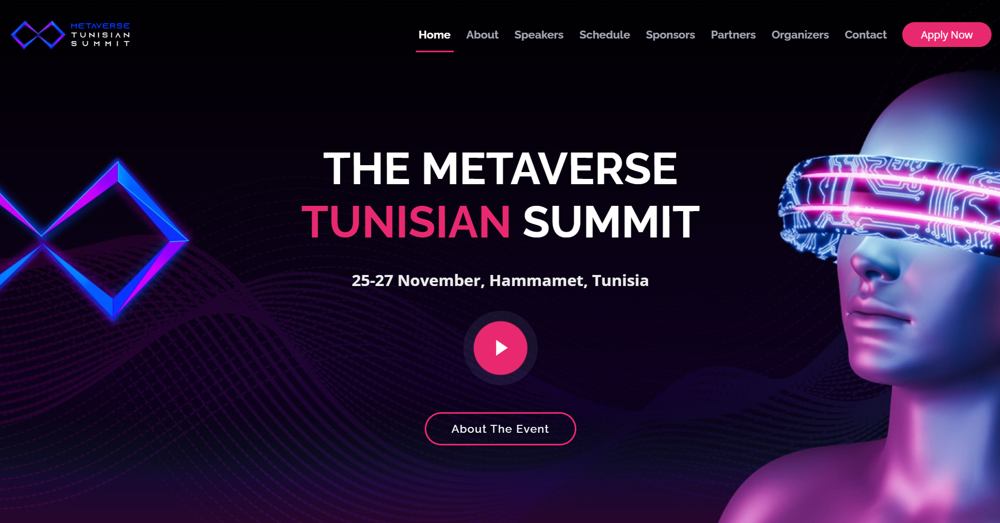

# 🌐 _Metaverse Tunisian Summit Website_

Welcome to the official GitHub repository for the **Metaverse Tunisian Summit** website. This website is built for the summit to showcase event details, schedules, speakers, and more.

### 📝 Website Overview
The website contains the following sections:
- 🏠 **Home**: Introduction to the event and key highlights.
- ℹ️ **About**: Information about the Metaverse Tunisian Summit's mission and objectives.
- 🎤 **Speakers**: Profiles of the event's speakers.
- 🗓️ **Schedule**: A detailed agenda of the summit events.
- 💼 **Sponsors**: Organizations supporting the summit.
- 🤝 **Partners**: Event partners and collaborators.
- 👥 **Organizers**: The team behind the event.
- 📞 **Contact**: Information to reach the organizers.
- 📝 **Apply to Participate**: Details and forms for those who want to participate in the event.

### 🏆 About The Event
The **Metaverse Tunisian Summit** is a 3-day conference that will take place from **November 25th to 27th**. The summit focuses on emerging technologies, particularly **Augmented Reality (AR)** and **XR technologies**. We aim to spotlight and develop the Metaverse ecosystem in Tunisia, building a strong community of innovators and technologists.
This project was conducted as part of my role as the webmaster for this event.

### Key Features:
- 🌟 **Shining a light on the Metaverse Eco-system in Tunisia**
- 🤝 **Fostering collaboration and innovation**
- 🌐 **Building a strong, engaged community around Metaverse technologies**

### 📧 Contact
For more information, visit the website or contact us using the details provided in the Contact section.

---

Thank you for being so interested in the Metaverse Tunisian Summit! 🎉
